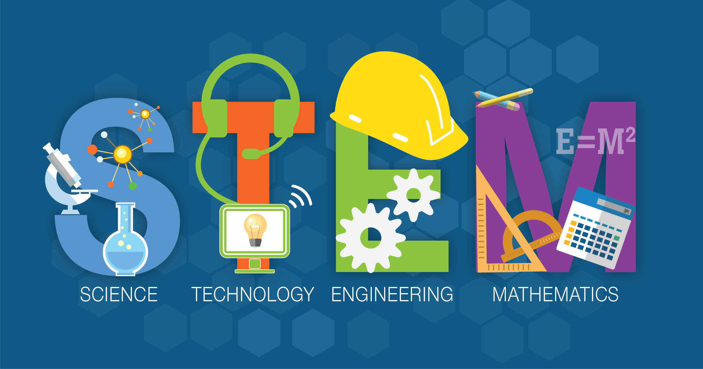
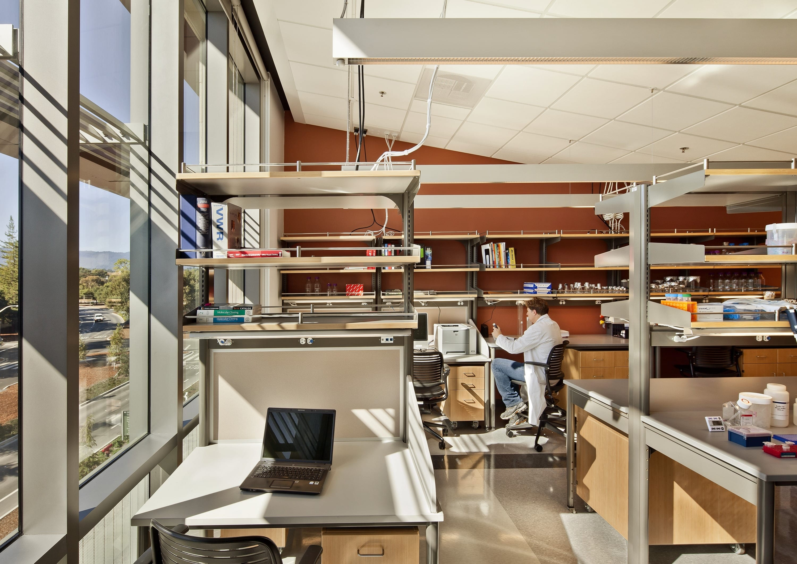
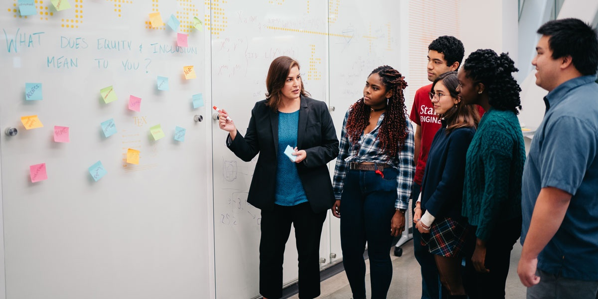
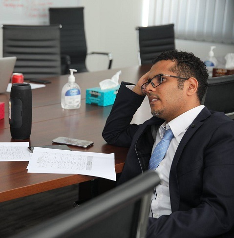

<!DOCTYPE html>
<html lang="en">
<head>
    <meta charset="UTF-8">
    <meta name="viewport" content="width=device-width, initial-scale=1">
    <title>Afghanistan STEM Academy Website</title>
    <meta name="viewport" content="width=device-width, initial-scale=1, shrink-to-fit=no">

    <!-- Bootstrap CSS -->
    <link rel="stylesheet" href="https://cdn.jsdelivr.net/npm/bootstrap@4.6.0/dist/css/bootstrap.min.css" integrity="sha384-B0vP5xmATw1+K9KRQjQERJvTumQW0nPEzvF6L/Z6nronJ3oUOFUFpCjEUQouq2+l" crossorigin="anonymous">
    
    
    <link rel="stylesheet" href="stem.css">
    <link rel="stylesheet" href="https://cdnjs.cloudflare.com/ajax/libs/font-awesome/4.7.0/css/font-awesome.min.css">
    <title>Title</title>
</head>
<body>
<!----- Top Menu  ---->
<nav class="navbar navbar-expand-lg navbar-light bg-light">
    <a class="navbar-brand" href="Hpage.html">Technology Academy of Afghanistan</a>
    <button class="navbar-toggler" type="button" data-toggle="collapse" data-target="#navbarSupportedContent" aria-controls="navbarSupportedContent" aria-expanded="false" aria-label="Toggle navigation">
        
    </button>

    

        <ul class="navbar-nav ml-auto">
            <li class="nav-item active">
                <a class="nav-link" href="Hpage.html">Home (current)</a>
            </li>
            <li class="nav-item">
                <a class="nav-link" href="Departments.html">Departments</a>
            </li>

            <li class="nav-item">
                <a class="nav-link" href="About_us.html">About Us</a>
            </li>
            <li class="nav-item">
                <a class="nav-link" href="contact_us.html" >Contact us</a>
            </li>
        </ul>

    

</nav>
<!----- Slider  ---->

    <ol class="carousel-indicators">
        <li data-target="#carouselExampleCaptions" data-slide-to="0" class="active"></li>
        <li data-target="#carouselExampleCaptions" data-slide-to="1"></li>
        <li data-target="#carouselExampleCaptions" data-slide-to="2"></li>
    </ol>
    

        

            
            

            

        

        

            
            

            

        

        

            
            

            

        

    

    <a class="carousel-control-prev" href="#carouselExampleCaptions" role="button" data-slide="prev">
        
        Previous
    </a>
    <a class="carousel-control-next" href="#carouselExampleCaptions" role="button" data-slide="next">
        
        Next
    </a>

<!--HTML and Bootstrap Jumbotron -->

    

        

            
 STM Department (Afghanistan Academy)

            
 The Division of Science, Technology and Mathematics of the Technology academy of Afghanistan has highly qualified and experienced faculty with a diverse background.
                It serves the best interests of Technology academy and the higher education of Afghanistan. The Division offers a state-of-the-art degree in Information Technology. It also provides courses in science, mathematics,
                statistics, quantitative analysis and information technology to students of other divisions and departments. The Division is also in charge of the preparation and running of Mathematics and Information Technology Placement Tests,
                and it is responsible for two computer laboratories, which are used both for teaching and for students practice.

            

        

            <a href="#"> <button type="button" class="btn btn-outline-secondary btn-lg"> About Us</button> </a>
        

    

<!---- -->

   

       

           

               

                   <h1 class="display-5"> Virtual Learning is offered in Pandemic from STEM</h1>

               

           

    

        

            <h1 class="display-4"> Meet the Staff</h1>
            

        

        

    

    

    

        

            

                

                    
                    

                        <h4 class="card-title"> Ala Abdulhakim Abdulaziz</h4>
                        
Juan Aleman is STEM Head and Information Technology Senior

                        <a href="#" class="btn btn-outline-secondary"> Visit Department</a>
            

        

    

            

                

                    
                    

                        <h4 clss="card-title"> Ayesha Rawan</h4>
                        
Professor Ayesha Rawan is a Senior Web Developement professor.

                        <a href="#" class="btn btn-outline-secondary"> Visit Department</a>
                    

                

            

            

                

                    
                    

                        <h4 clss="card-title">Dr. Samiullah Naji</h4>
                        
Dr. Sami AlKindi is a Senior programming professor at the Technology campus.

                        <a href="#" class="btn btn-outline-secondary"> Visit Department</a>
                    

                

            

    

    

        

            <h1 class="display-4"> Thinking About it </h1>
        

        

    

<!------ -->

    

        

            <h2> Future in STEM?</h2>
            
 A focus on Science, Technology, Engineering, and Math (STEM) has been at the forefront of education trends in America for the past several years. This is for good reason—jobs in STEM fields are growing rapidly without enough qualified workers to fill them.
                These employment opportunities can be incredibly interesting and fulfilling, which has led more and more students in the US to express interest in them.     Lorem ipsum dolor sit amet, consectetur adipiscing elit, sed do eiusmod tempor incididunt ut labore et dolore magna aliqua. Ut enim ad minim veniam, quis nostrud exercitation ullamco laboris nisi ut aliquip ex ea commodo consequat.
                Duis aute irure dolor in reprehenderit in voluptate velit esse cillum dolore eu fugiat nulla pariatur. Excepteur sint occaecat cupidatat non proident, sunt in culpa qui officia deserunt mollit anim id est laborum.

        

        

            
        

    

<footer class="bg-dark text-center text-white">
    

        <section class="mb-1">
            
            
            

        </section>

        <section class="">
            <form action="">

                

                    

                        

                            <input type="email" id="ffooter" class="form-control" />
                            <label class="form-label" for="ffooter">Email address</label>
                        

                    

                    

                        <button type="submit" class="btn btn-outline-light mb-5"> Subscribe </button>
                    

                

            </form>
        </section>

        <section class="">

    

        © 2020 Copyright:
        <a class="text-white">STM Department</a>
    

</footer>

</body>
</html>
